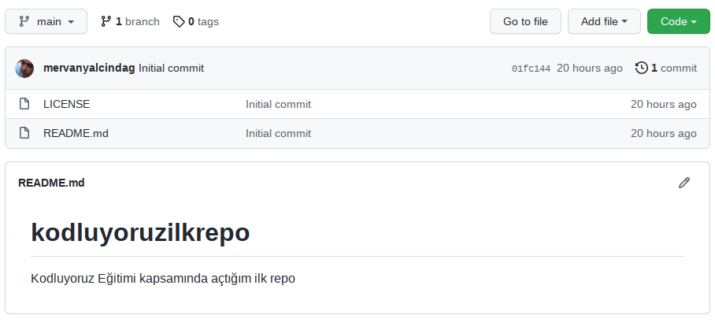

# Kodluyoruz İlk Repo
Bu repo [Patika.dev](https://app.patika.dev/moduller/git/odev1) Front-End Eğitimi kapsamında açtığım ilk repo. İçerisinde bir adet README dosyası, bir adet de index.html barındırıyor.

## Installation
Önceki projeyi kolonlayın
```
git clone https://github.com/mervanyalcindag/kodluyoruzilkrepo.git
```

## Useage
Projeyi kolonladıktan sonra Visual Studio Code programında açınız.

Linux için:

```
cd kodluyoruzilkrepo
code .
```

## Contributing
Pull requestler kabul edilir.  Büyük değişiklikler için, lütfen önce neyi değiştirmek istediğinizi tartışmak için bir konu açınız.

## Lisans

[MIT](https://opensource.org/licenses/MIT)


